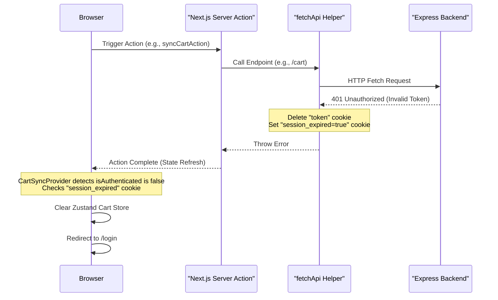

# 2026-06-01 Logout on 401 Design Document

## Context
When a user has an invalid or expired JWT token, the Express backend returns a `401 Unauthorized` status code. In the Next.js frontend, all API calls go through the central `fetchApi` wrapper. Currently, when an API call gets a 401, the frontend continues to assume the user is authenticated until they manually log out or the page is refreshed. 

To resolve this elegantly, we need to immediately log out the user and redirect them to `/login` when any API request receives a 401, without having to write boilerplate try/catch handling in every single server action.

## Design
We will use a combined Server-Side + Client-Side approach to achieve a completely automated, zero-action-modification logout.

### Components

#### 1. Server-Side Cookie Deletion & State Setting (`fetchApi`)
We update `fetchApi` inside `apps/frontend/helpers/api.ts` to intercept `401` status codes.
- It will import `cookies` from `next/headers`.
- It will delete the `"token"` cookie: `cookieStore.delete("token")`.
- It will set a transient, non-HttpOnly cookie `"session_expired"` to `"true"`, which is accessible from the client-side JavaScript.
- We wrap this in a safe try/catch block to avoid crashes if `fetchApi` is ever run during Server Component rendering (since cookies can't be mutated during rendering in Next.js).

#### 2. Client-Side Global Interception (`CartSyncProvider`)
We update `CartSyncProvider` in `apps/frontend/components/CartSyncProvider.tsx` which already wraps the layout.
- We listen to the `isAuthenticated` prop (which represents whether the `"token"` cookie exists on the server).
- When a server action completes, Next.js refreshes the Server Components, causing the client to receive the updated `isAuthenticated` value.
- If `isAuthenticated` is false, `CartSyncProvider` checks for the presence of the `"session_expired"` cookie.
- If `"session_expired"` is set:
  - It clears the `"session_expired"` cookie so this only runs once.
  - It clears the client-side Zustand store cart items using `clearCart()`.
  - It redirects the user using `window.location.href = "/login"`.

## Verification Plan
1. Validate that the `"session_expired"` cookie is correctly set and the `"token"` cookie is removed when `fetchApi` receives a `401` status code.
2. Verify that the client is redirected to `/login` immediately when `session_expired` is set and `isAuthenticated` changes to `false`.
3. Confirm that the local Zustand cart is fully cleared on session expiration.
